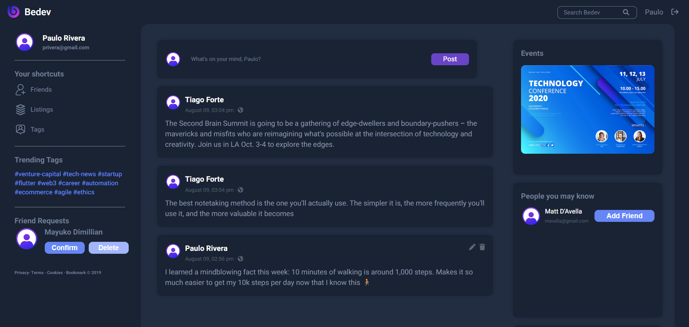

# Bedev: Social Networking Website

## Description
Bedev is a full-stack social networking application built using the MERN stack. This app provides a platform for users to connect, share posts, and interact with their friends. It offers features such as user sign-up, a post feed page, post creation and editing, adding friends, and user profiles.

## Technologies Used

## Installation
To run the project locally, follow these steps:

1. Clone the repository: `https://github.com/coleenagsao/bedev-social-network-website.git`
2. Navigate to the frontend directory: `cd frontend`
3. Install the dependencies: `npm install`. If you encountered npm installation issues, use `npm install --legacy-peer-deps` instead.
4. Do the same with the backend directory.
4. Make sure your MongoDB is running in your machine.
5. Start the development server in the backend directory: `node index.js`
6. Start the website in the frontend directory: `npm start`

Make sure you have MongoDB, Express, React, and Node.js installed on your machine before proceeding with the installation.

## Screenshots

*Screenshot of the Signup Page*

*Screenshot of the Login Page*

*Screenshot of the Home Page*

## License
This project is licensed under the [Creative Commons Attribution-NonCommercial-ShareAlike (CC BY-NC-SA) 4.0 International License](https://creativecommons.org/licenses/by-nc-sa/4.0/).

## Additional Notes
Bedev is an academic project developed as a part of CMSC 100 (Web Programming) in UPLB. 